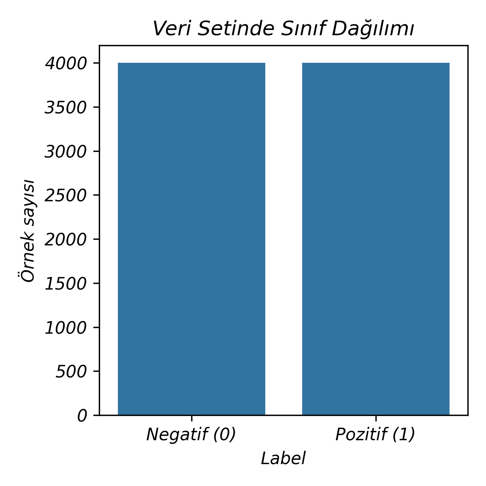
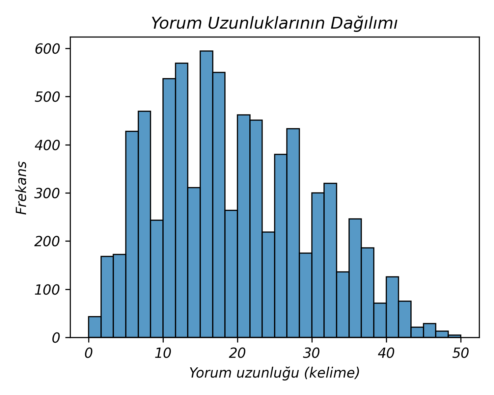
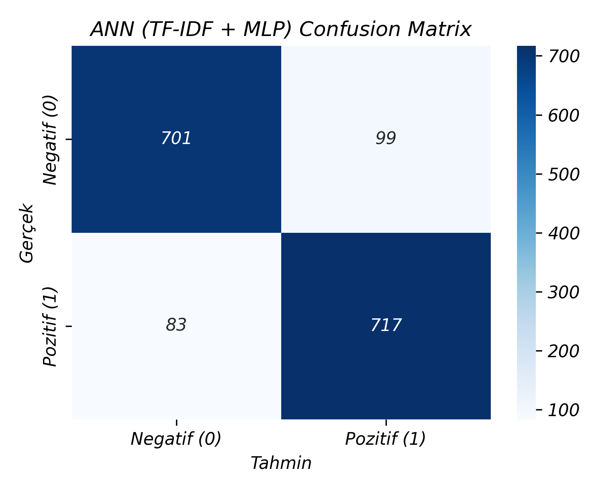
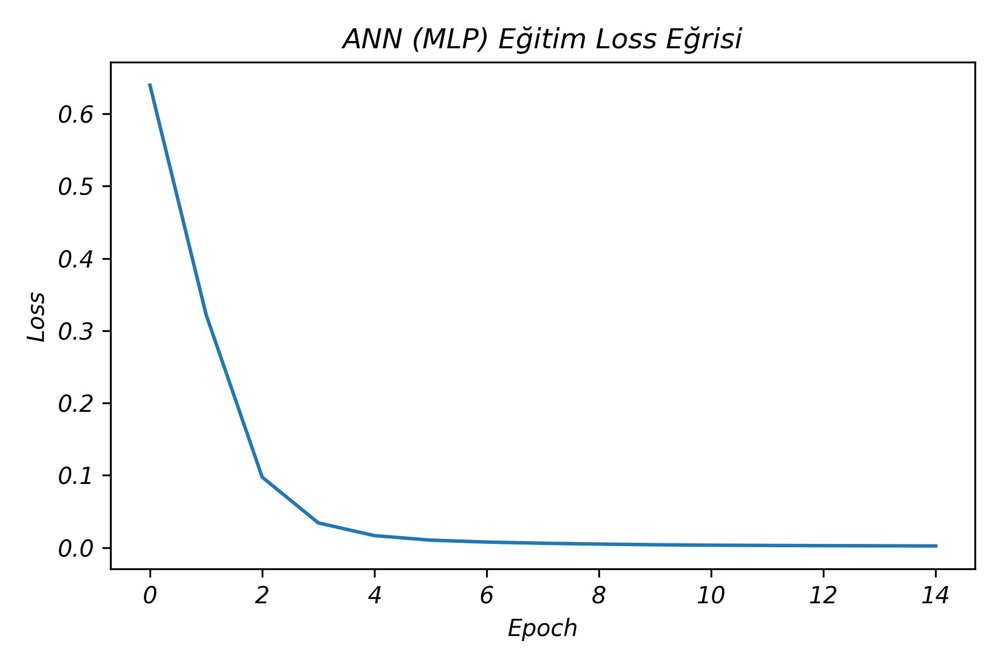
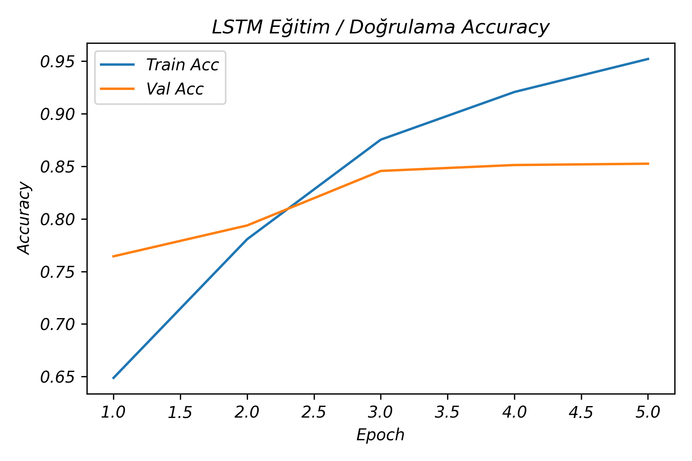
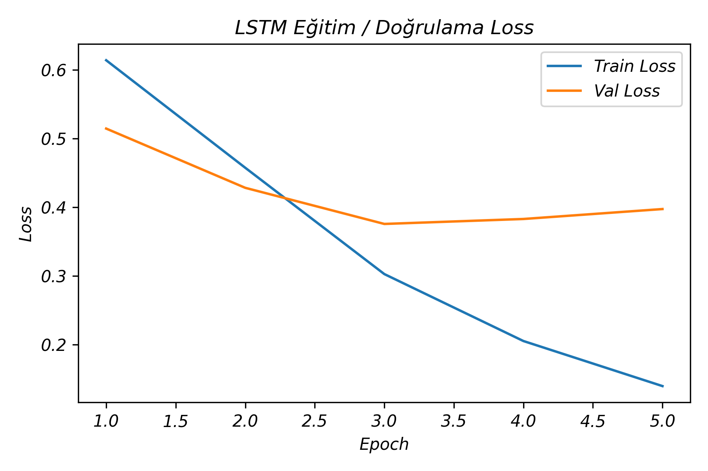
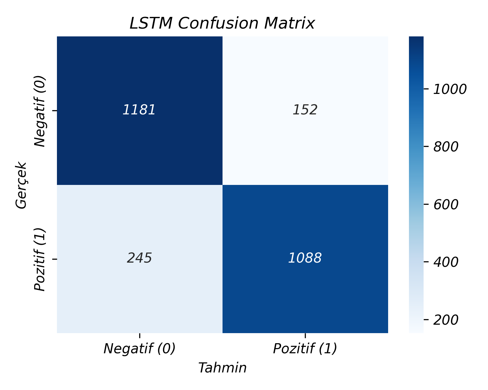

python -c "
import os

content = \"\"\"# Türkçe Film Yorumlarında Duygu Analizi: ANN ve LSTM Karşılaştırması

## 📝 Özet (Abstract)
Bu çalışmada, Türkçe film yorumlarının olumlu ya da olumsuz olarak otomatik biçimde sınıflandırılması ele alınmıştır. Amaç, aynı veri seti üzerinde iki farklı derin öğrenme yaklaşımının performansını karşılaştırmaktır:
1. **ANN (Yapay Sinir Ağı):** TF-IDF özellikleri üzerinde çalışan model.
2. **LSTM (Long Short-Term Memory):** Ham kelime dizilerini giriş olarak alan tekrarlayan sinir ağı.

Çalışmada Kaggle platformunda paylaşılan **“Turkish Sentiment Analysis Data – beyazperde.com”** veri seti kullanılmıştır.

**Sonuç:** TF-IDF + ANN modeli (**%89.3**), LSTM modelinden (**%85.1**) daha yüksek doğruluk elde etmiştir.

---

## 1. Giriş
Duygu analizi, metinlerin olumlu, olumsuz veya nötr olarak sınıflandırılmasıdır. Bu projede, Türkçe film yorumları üzerinde **klasik vektör uzayı temelli ANN** ile **sıralı veri (sequential data) için tasarlanmış LSTM** modelleri karşılaştırılmıştır.

---

## 2. Veri Seti (Dataset)
Veri seti, *beyazperde.com* film yorumlarından oluşmaktadır.
- **Eğitim Seti:** 7,996 satır
- **Test Seti:** 2,666 satır
- **Etiketler:** 0 (Negatif), 1 (Pozitif)

Veri seti dengelidir (3998 Negatif, 3998 Pozitif).

*Şekil 1. Veri setinde sınıf dağılımı*

Yorumların çoğu 5–40 kelime uzunluğundadır. LSTM modeli için **maksimum uzunluk (sequence length) 100** olarak belirlenmiştir.

*Şekil 2. Yorum uzunluklarının dağılımı*

### Örnek Veriler
| Yorum | Etiket | Anlam |
|-------|--------|-------|
| \"film tek kelimeyle muhtesemdi heleki sonundaki sahne harikaydi.\" | 1 | Pozitif |
| \"film biraz daha uzun sürse harbi kiyameti görürdük, çok sıkıcıydı.\" | 0 | Negatif |
| \"pek orjinal bi cinayet yok ama orjinal oyunculuklar var.\" | 0 | Negatif |

---

## 3. Problem Tanımı
Bu bir ikili sınıflandırma (binary classification) problemidir.
- **Girdi (X):** Film yorumu metni.
- **Çıktı (y):** {0, 1} (Negatif veya Pozitif).

---

## 4. Kullanılan Yöntemler

### 4.1 Metin Ön İşleme
- Küçük harfe dönüştürme.
- Noktalama işaretleri ve özel karakter temizliği.
- Fazla boşlukların silinmesi.

### 4.2 TF-IDF Tabanlı ANN Modeli
- **Vektörleştirme:** TF-IDF (Term Frequency – Inverse Document Frequency).
- **Mimari:** İki gizli katmanlı MLP (Multi-Layer Perceptron).
- **Aktivasyon:** ReLU.
- **Optimizasyon:** Adam.

### 4.3 LSTM Tabanlı RNN Modeli
- **Girdi:** Embedding katmanı ile vektöre dönüştürülen kelime dizileri.
- **Mimari:** Çift Yönlü (Bidirectional) LSTM.
- **Hiperparametreler:** 5 Epoch, CrossEntropyLoss, Adam Optimizasyonu.

---

## 5. Değerlendirme ve Sonuçlar

### 5.1 ANN Modeli Sonuçları
- **Test Doğruluğu:** %89.3
- **Doğrulama Doğruluğu:** %88.6

*Şekil 3. ANN modeli karışıklık matrisi*

*Şekil 4. ANN eğitim kayıp (loss) eğrisi*

### 5.2 LSTM Modeli Sonuçları
- **Test Doğruluğu:** %85.1
- **Doğrulama Doğruluğu:** %85.2

Model negatif yorumları tespit etmekte daha başarılıyken, bazı pozitif yorumları negatif olarak etiketleme eğilimindedir.

*Şekil 5. LSTM doğruluk eğrisi*

*Şekil 6. LSTM kayıp (loss) eğrisi*

*Şekil 7. LSTM karışıklık matrisi*

### 5.3 Karşılaştırma Tablosu

| Model | Test Doğruluğu (Accuracy) | F1-Skoru |
|-------|---------------------------|----------|
| **ANN (TF-IDF)** | **%89.3** | **0.89** |
| LSTM (Bi-LSTM) | %85.1 | 0.85 |

Veri setinin orta ölçekli olması ve duygu bilgisinin anahtar kelimelerde saklı olması (kelime sırasından ziyade kelime varlığının önemli olması) nedeniyle TF-IDF tabanlı ANN daha başarılı olmuştur.

---

## 6. Gelecek Çalışmalar
- CNN tabanlı metin sınıflandırma modelleri denenebilir.
- Türkçe için eğitilmiş **BERT (BERTurk)** modelleri ile ince ayar (fine-tuning) yapılabilir.
- Veri çoğaltma (Data Augmentation) teknikleri uygulanabilir.

## 7. Kaynakça
- Kaggle, Turkish Sentiment Analysis Data – beyazperde.com veri seti.
\"\"\"

with open('README.md', 'w', encoding='utf-8') as f:
    f.write(content)
print('README.md basariyla olusturuldu.')
"
